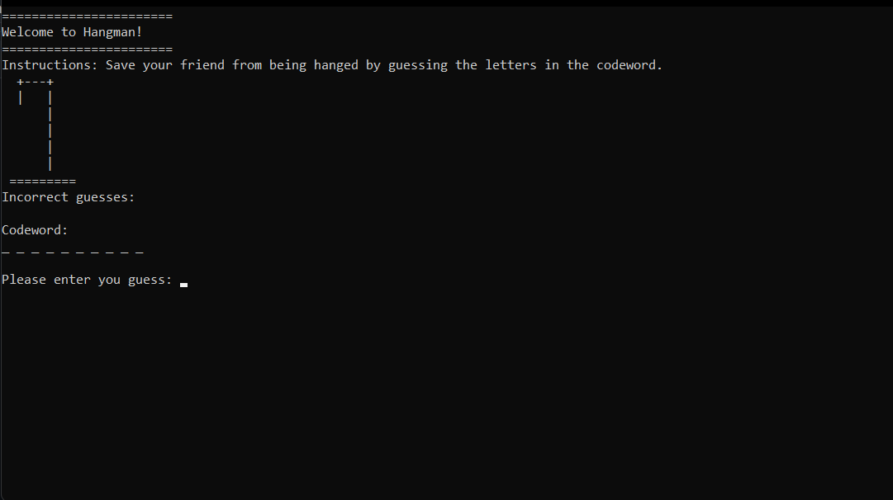
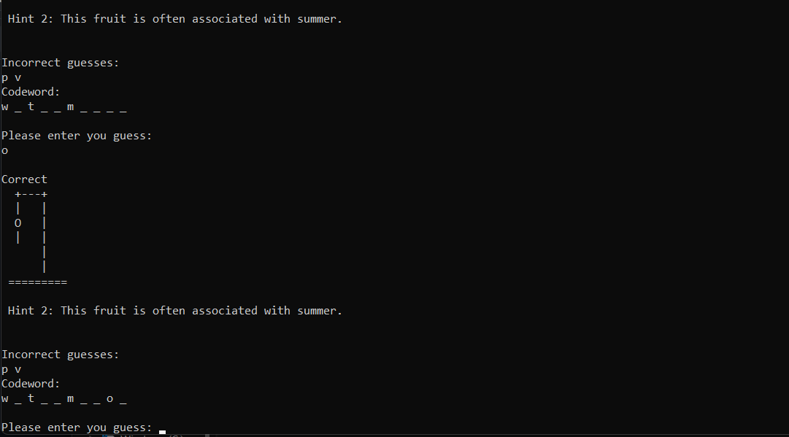

# Hangman-Project
Hangman Project made with using C++ Programming Language 



## Overview
The Hangman Project is a simple word-guessing game implemented in C++. Players try to guess the word by suggesting letters within a limited number of guesses.

## Features
- User-friendly console interface
- Simple and straightforward gameplay
- Visual representation of incorrect guesses

## Screenshots
### Main Menu


### Gameplay


### Game Over


## Installation
1. Clone the repository:
    ```sh
    git clone https://github.com/yourusername/hangman-project.git
    ```
2. Navigate to the project directory:
    ```sh
    cd hangman-project
    ```
3. Compile the code:
    ```sh
    g++ -o hangman main.cpp hangman_functions.cpp
    ```

## How to Play
1. Run the game:
    ```sh
    ./hangman
    ```
2. The game will greet you and display the initial status.
3. Start guessing letters by typing them and pressing enter.
4. You have 6 chances to guess the correct word.
5. Each incorrect guess will draw another part of the hangman.
6. The game ends when you either guess the word correctly or run out of chances.

   
## Contributing
Contributions are welcome! Please fork the repository and create a pull request with your changes. Make sure to follow the code of conduct.


## Contact
For any questions or suggestions, feel free to open an issue or contact us at mayanklakkewar.work@gmail.com.
